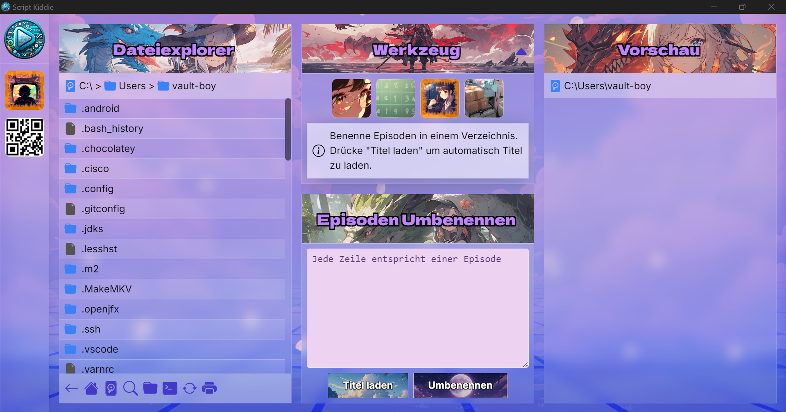
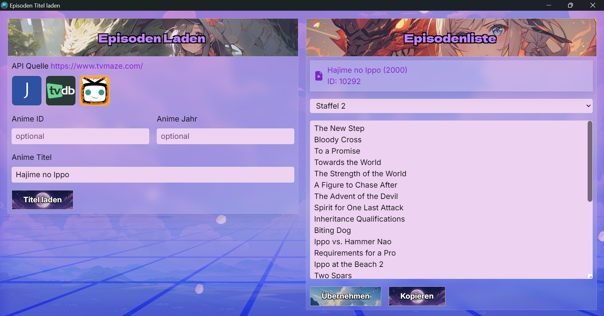
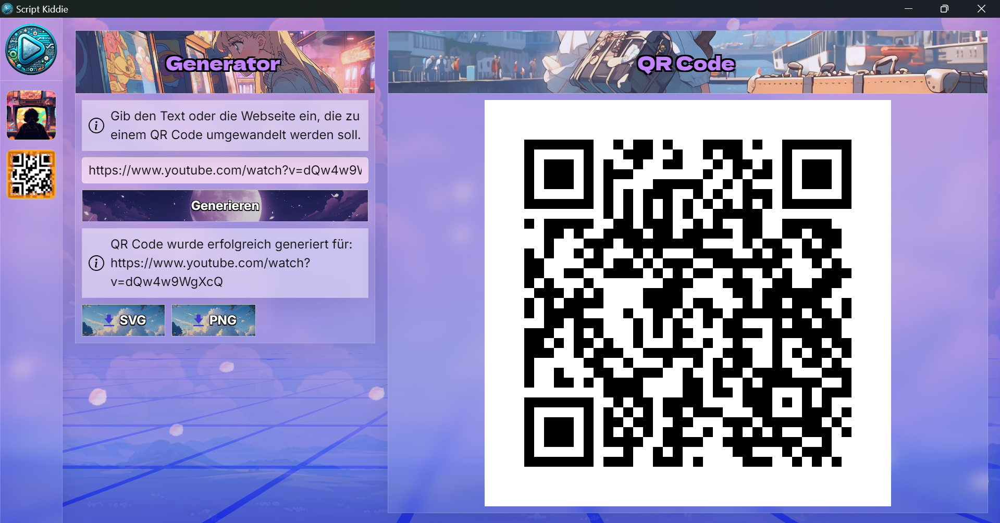

# Script Kiddie 🌸

A Rust-based application for batch editing media episode titles and similar metadata. Built with Cargo, Tauri, Rust, Next.js, and TailwindCSS.

## 🚀 Features

- **Batch Edit Titles**: Easily batch edit media episode titles.
    - search and replace
    - change episode numbers by int
    - edit or remove titles
- **API Integration**: Fetch data from APIs for show details, episodes, and more.
    - [Jikan](https://jikan.moe/)
    - [TvMaze](https://www.tvmaze.com/)
    - [TheTVDB](https://www.thetvdb.com/)
- **File Organizing**: Move every media file in directory into seperate folders or pull each media file from folders back into directory.
- **QR Code Generator**: Generate QR Codes.
- **File Size Printer**: Print file sizes of media files in directory.

## 🎨 Tech Stack

- **Frontend**: [Next.js](https://nextjs.org/), [TailwindCSS](https://tailwindcss.com/)
- **Backend**: [Rust](https://www.rust-lang.org/), [Tauri](https://tauri.studio/)
- **Build System**: [Cargo](https://doc.rust-lang.org/cargo/)

## 📸 Screenshots

| Home Page | Show Details | QR Codes |
| --------- | ------------- | -------- |
|  |  |  |

## 🛠 Installation and Setup

1. **Clone the Repository**

   ```bash
   git clone https://github.com/david-stefan-hermann/script-tool.git
   cd script-tool
   ```

2. **Install Rust and Cargo**

    [More Information](https://doc.rust-lang.org/cargo/getting-started/installation.html)

3. **Install Dependencies**

    ```bash
    cargo install tauri-cli
    ```

4. TODO, sorry :/

## 🤝 Contributing

Contributions are welcome! If you want to contribute, please open an issue or submit a pull request.
